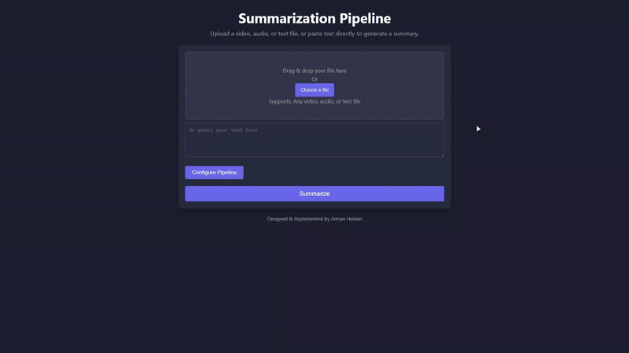

# Summarization Pipeline

## Overview

The **Summarization Pipeline** is a powerful tool designed to process video, audio, or text inputs and generate concise summaries using advanced natural language processing (NLP) techniques. Built with Python and FastAPI, this project integrates multiple components, including speech-to-text transcription, summarization, and file conversion, to deliver a seamless end-to-end solution.

**Key Features**:
- **Multi-Format Support**: Handles video, audio, and text inputs.
- **Customizable Summarization**: Choose between thematic or priority-based summarization prompts.
- **Flexible Configuration**: Configure language, audio format, and LLM client (e.g., OpenRouter, Together).
- **User-Friendly Web Interface**: A clean and intuitive web app for uploading files, configuring options, and viewing results.

---

## Table of Contents

1. [Demo](#demo)
2. [Installation](#installation)
3. [Configuration](#configuration)
4. [Usage](#usage)
5. [Project Structure](#project-structure)
6. [Contributing](#contributing)
7. [License](#license)
8. [Upcoming Features](#upcoming-features)
9. [Acknowledgments](#acknowledgments)

---

## Demo

Here’s a demo of the project in action:

[](https://vimeo.com/1057146672/22fd5e4fe0?share=copy)
*This GIF demonstrates the summarization pipeline in action. For a better demonstration, [watch the full video here](https://vimeo.com/1057146672/22fd5e4fe0?share=copy).*

---

## Installation

### Prerequisites

- Python 3.9 or higher
- FFmpeg (for audio/video processing)
- Vosk models (download instructions below)

### Steps

1. **Clone the Repository**:
    ```bash
    git clone https://github.com/your-username/summarization-pipeline.git
    cd summarization-pipeline
    ```

2. **Set Up a Virtual Environment**:

    ```bash
    python -m venv venv
    source venv/bin/activate  # On Windows: venv\Scripts\activate
    ```

3. **Install Dependencies**:
    ```bash
    pip install -r requirements.txt
    ```

4. **Download Vosk Models**:

  - Download the following Vosk models and place them in the models/ folder:
    - [Vosk Model for English](https://alphacephei.com/vosk/models/vosk-model-en-us-0.22.zip)
    - [Vosk Model for Persian](https://alphacephei.com/vosk/models/vosk-model-fa-0.42.zip)
  
  - Extract the models and ensure the folder structure looks like this:
      ```
      models/
      ├── vosk-model-en-us-0.22/
      └── vosk-model-fa-0.42/
      ```

5. **Set Up the `.env` File**:
   
    Create a `.env` file in the project root and add your API keys (if required):

      ```env
      OPENROUTER_API_KEY=your_openrouter_api_key
      TOGETHER_API_KEY=your_together_api_key
      ```

---

## Configuration
The project is highly configurable. Key configuration options include:

- Language: Choose between English or Persian.
- Audio Format: Specify the output audio format (e.g., WAV).
- Summarization Prompt: Select between thematic or priority-based summarization.
- LLM Client: Use OpenRouter or Together for summarization.

These options can be set via the web interface or directly in the code (if you want to run the tests).

---

## Usage

**Running the Application**

1. Start the FastAPI server:

    ```bash
    python src/main.py
    ```

2. Open your browser and navigate to:
  
    ```
    http://localhost:8000
    ```

3. Use the web interface to:

- Upload a video, an audio, or a text file or write a text in the provided field.
- Configure summarization options.
- View and download the summarized output.

**Example API Request**

  You can also interact with the pipeline programmatically using the `/summarize` endpoint:

  ```bash
  curl -X POST -F "file=@sample.mp4" -F "language=English" -F "audio_format=WAV" -F "prompt=Thematic" -F "client=OpenRouter" -F "model=google/gemini-2.0-pro-exp-02-05:free" http://localhost:8000/summarize
  ```

---

## Project Structure
  
  ```
  summarization-pipeline/
  ├── audios/                # Converted audio files
  ├── models/                # Vosk models for speech-to-text
  ├── samples/               # Sample inputs for testing
  ├── transcriptions/        # Generated transcriptions
  ├── src/                   # Main source code
  │   ├── clients/           # LLM client implementations
  │   ├── config/            # Configuration classes
  │   ├── convertion/        # File conversion logic
  │   ├── llm/               # Large language model utilities
  │   ├── pipeline/          # Core pipeline logic
  │   ├── prompts/           # Summarization prompts
  │   ├── summarization/     # Summarization logic
  │   ├── transcription/     # Speech-to-text transcription
  │   ├── ui/                # Web interface files
  │   ├── main.py            # FastAPI application entry point
  │   └── utils.py           # Utility functions
  ├── .env                   # Environment variables
  ├── .gitignore             # Files to ignore in version control
  ├── LICENSE                # Project license
  ├── README.md              # Project documentation
  └── requirements.txt       # Python dependencies
  ```

---

## Contributing

Contributions are welcome! If you'd like to contribute, please follow these steps:

1. Fork the repository.
2. Create a new branch for your feature or bugfix.
3. Commit your changes and push to the branch.
4. Submit a pull request.

---

## License

This project is licensed under the MIT License. See the LICENSE file for details.

---

## Upcoming Features

- **PDF Support**: Summarize text directly from PDF files.
- **Webpage Crawler**: Extract and summarize content from webpages.

---

### Acknowledgments
- [Vosk](https://alphacephei.com/vosk/) for speech-to-text transcription.
- [FastAPI](https://fastapi.tiangolo.com/) for the web framework.
- [OpenRouter](https://openrouter.ai/) and [Together](https://www.together.ai/) for LLM integration.
- [BBCLearningEnglish](https://www.youtube.com/@bbclearningenglish) for the `like.mp4`.
